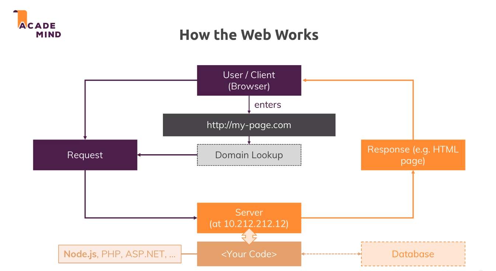

# NodeJS Academind

### All code and comments written by Júlio Juriolli

In pure NodeJS code, we have to manually deal with the logic of managing routes, creating servers, listening to packages and converting the buffer chunks into readable information. But as we go on with the course, we start seeing expressJS as an easier way to make the server logic, as a way of giving more focus to the business logic of the application.

---

To start this course, first we need to take a look at how a webpage works. 
- This is the summary of how the web works.

# NodeJS Server Creation
In order to create a server, we have to firstly call the http package (that is installed in the machine)

    const http = require('http');

Again, all this steps are a manual way of creating and listening to a server. With ExpressJS, we can manage all this operation in an automatic way.

Now we have access to all http's methods and properties. The method we want to call is http.createServer()

    http.createServer()

The server itself is returned from the call of the function above. So we got to create a variable and assign the server call to it

    const server = http.createServer()

In order to listen for incoming requests, we have to create pass a function as a parameter to the server creation function

    const server = http.createServer((req, res) => {
        console.log(req);
    })

The last step of the creation of the server is to open a port in which we can listen to requests.

    server.listen(3000)

- Everytime someone tries to access our server on the 3000 port, our arrow function will be called. This is called a *requisition*. That's why we have the req and res parameters inside the function.
---

## Express

With the presence of the express framework, we can make things less complicated. 

    const express = require('express')
    const app = express()
    app.use( /* insert here the routes we want to use*/)